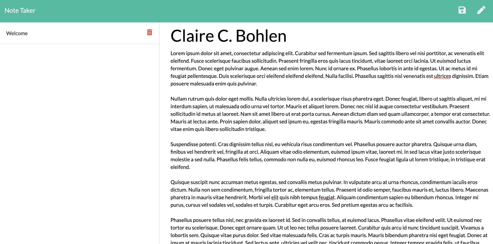

[![LinkedIn][linkedin-shield]][linkedin-url]
[![MIT License][license-shield]][license-url]
[![Portfolio][portfolio-shield]][portfolio-url]
<!-- See bottom of readme for badge information -->


<!-- MY LOGO FROM NOUN PROJECT-->
<br />
<p align="center">
  <a href="https://github.com/ClaireBohlen">
    
  </a>

  <h3 align="center">Express Note Taker</h3>

  <p align="center">
    As a user, I want to be able to write and save notes, delete notes &edit notes so I can organize my thoughts and keep track of tasks I need to complete
    <br />
    <!-- Enter repo url here -->
    <a href="https://github.com/ClaireBohlen/noteTaker"><strong>Explore the Repo »</strong></a> 
    <br />
    <br />
    <a href="https://fathomless-springs-57799.herokuapp.com/">Live Demo 🚀</a>
    
   
  </p>
</p>


<!-- Table of Contents -->
<details open="open">
  <summary><h2 style="display: inline-block">Table of Contents</h2></summary>
  <ol>
    <li>
      <a href="#about-the-project">About The Project</a>
      <ul>
        <li><a href="#built-with">Built With</a></li>
      </ul>
    </li>
    <li>
      <a href="#getting-started">Getting Started</a>
      <ul>
        <li><a href="#prerequisites">Prerequisites</a></li>
        <li><a href="#installation">Installation</a></li>
      </ul>
    </li>
    <li><a href="#usage">Usage</a></li>
    <li><a href="#roadmap">Roadmap</a></li>
    <li><a href="#contributing">Contributing</a></li>
    <li><a href="#license">License</a></li>
    <li><a href="#contact">Contact</a></li>
    <li><a href="#acknowledgements">Acknowledgements</a></li>
  </ol>
</details>


<!-- ABOUT THE PROJECT -->
## About The Project

<!-- Take a screen shot and save it in readMeAssets -->



For users that need to keep track of a lot of information, it's easy to forget or be unable to recall something important. Being able to take persistent notes allows users to have written information available when needed.

* GET `/api/notes` - SWill read the `db.json` file and return all saved notes as JSON.

* POST `/api/notes` - Will receive a new note to save on the request body, add it to the `db.json` file, and then return the new note to the client.

* DELETE `/api/notes/:id` - Will receive a query parameter containing the id of a note to delete. 
  
* GET `/notes` - Willreturn the `notes.html` file.

* GET `*` - Will return the `index.html` file


### Built With
<!-- * [Laravel](https://laravel.com) -->
* JavaScript
* Node.js
* Express
* CSS & HTML
* jQuery
* JSON 


<!-- GETTING STARTED -->
## Getting Started

To get a local copy up and running follow these simple steps.

### Prerequisites


<!-- Node Package Manager -->

  ```sh
  npm install npm@latest -g
  ```

### Installation

1. Clone the repo
   ```sh
   git clone https://github.com/ClaireBohlen/noteTaker.git
   ```
2. Install NPM packages
   ```sh
   npm install
   ```


<!-- LICENSE -->
## License

Distributed under the MIT License. See `LICENSE` for more information.


<!-- CONTACT -->
## Contact

Claire C. Bohlen - clairebohlen@gmail.com


[portfolio-shield]: https://img.shields.io/badge/PORTFOLIO-URL-blueviolet
[portfolio-url]: https://clairebohlen.github.io/React-Update-Portfolio-2.0/#/


[license-shield]: https://img.shields.io/badge/LICENSE-MIT-blueviolet
[license-url]: (./readMeAssets/LICENSE.txt)

[linkedin-shield]: https://img.shields.io/badge/-LINKEDIN-blueviolet
[linkedin-url]: https://www.linkedin.com/in/claire-bohlen-63a4b5119/
